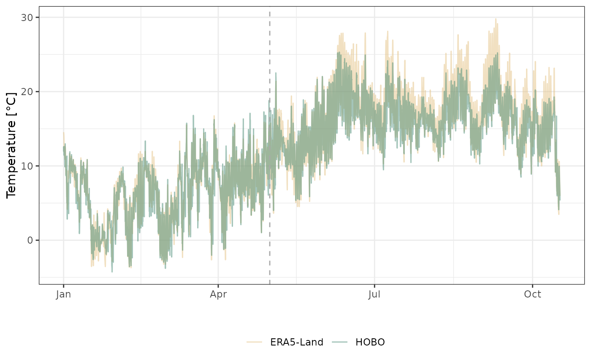
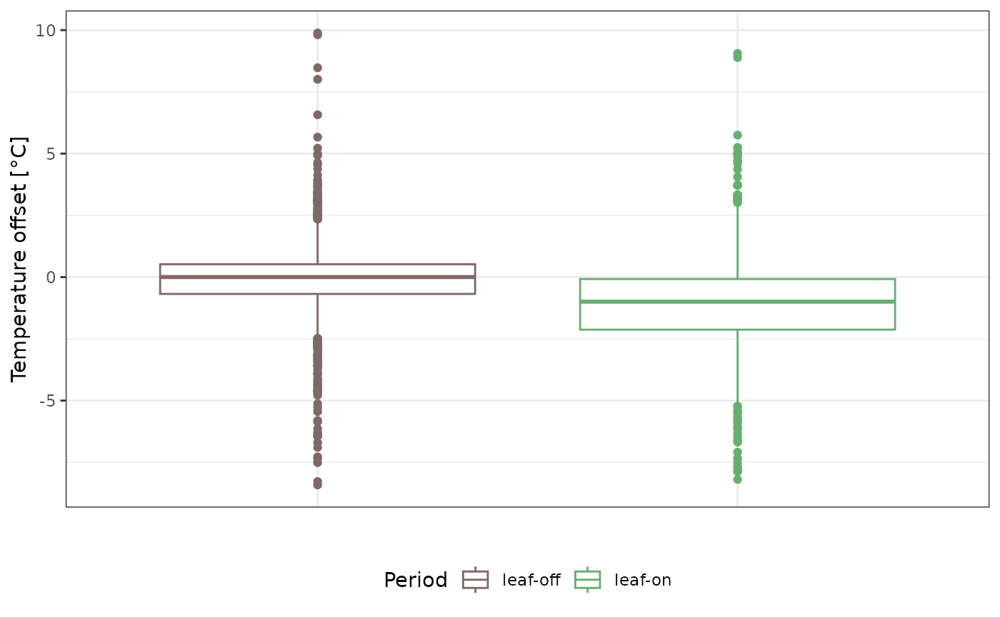
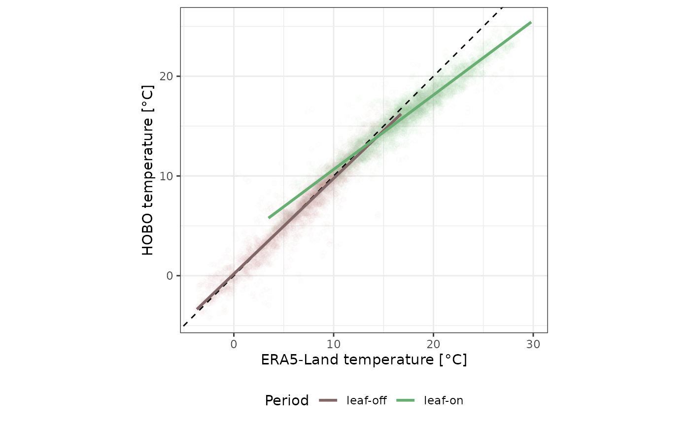
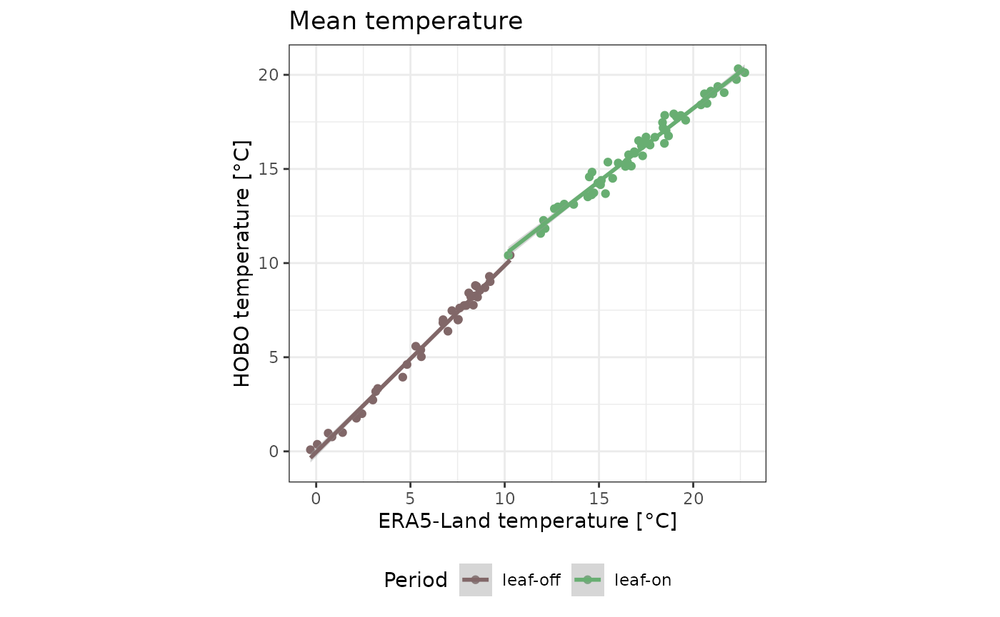
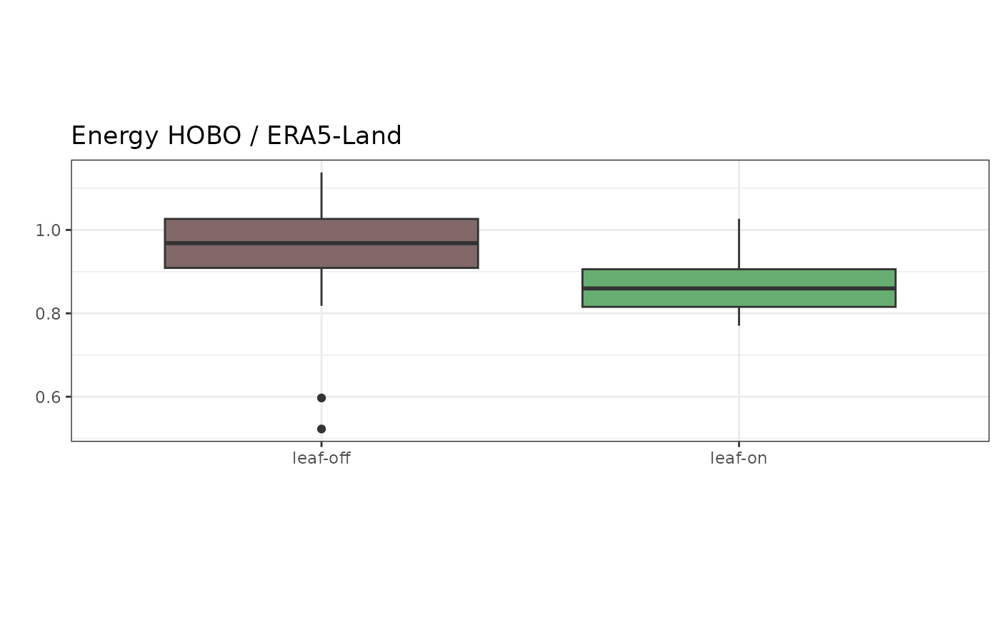
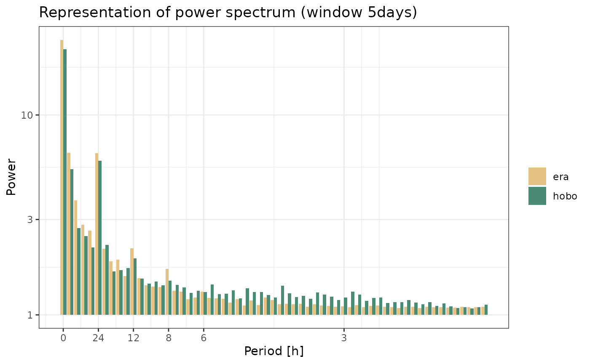
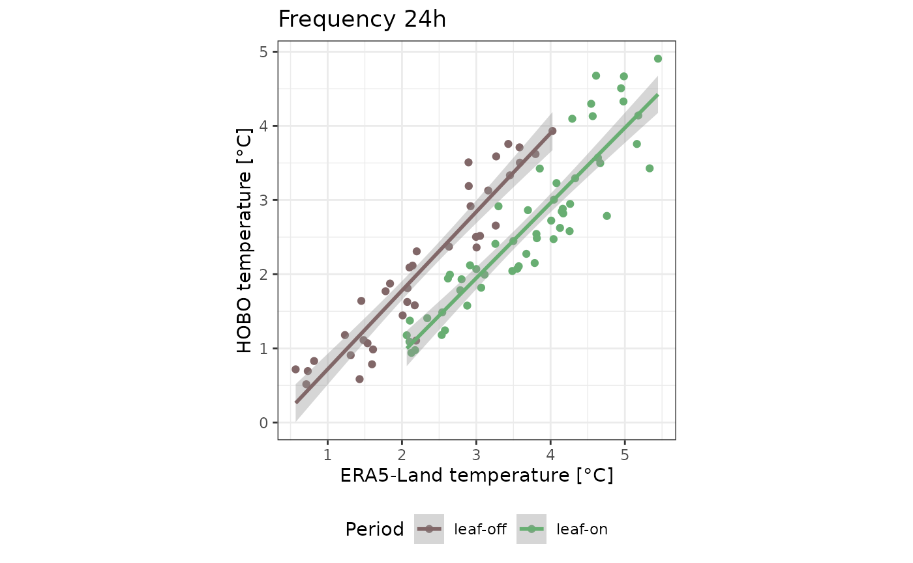
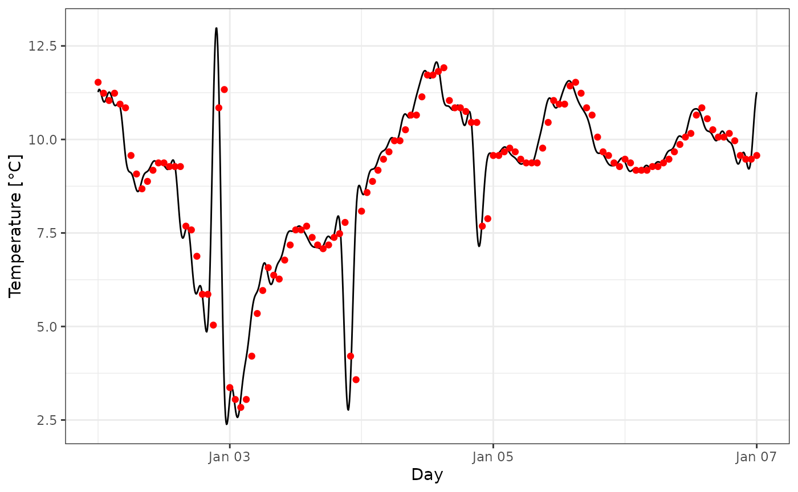

# Example

The example relies on `microclimr` for microclimate data analyses,
`dplyr`, `tidyr` and `broom` for table manipulations, `lubridate` for
dates wrangling, and `ggplot2` for graphic creations (a few will be
replaced by the package functions itself).

``` r

library(microclimr)
library(ggplot2)
library(dplyr)
library(tidyr)
library(lubridate)
library(broom)
```

## Data

Data are composed of air temperature at 1-m above the ground at every
hour for the HOBO sensor “59-32-a” in 2023 within plot “59-32” from the
Mormal forest joined by date and time with ERA5-Land temperature at 2m
been extracted from the Google Earth Engine (GEE) for longitude 3.70 and
latitude 50.2 corresponding to the Mormal forest.

``` r

data <- hobo |>
  left_join(rename(era, datetime = time), by = join_by(datetime)) |>
  mutate(season = ifelse(month_num %in% 5:11, "leaf-on", "leaf-off"))
data |>
  ggplot(aes(x = datetime)) +
  geom_line(aes(y = tas, col = "ERA5-Land"), alpha = .5) +
  geom_line(aes(y = t_hobo, col = "HOBO"), alpha = .5) +
  theme_bw() +
  theme(legend.position = "bottom") +
  ylab("Temperature [°C]") +
  xlab("") +
  scale_color_manual("", values = c("#e4c284", "#4a8b76")) +
  geom_vline(
    xintercept = as_datetime("2023-05-01 00:00:00"),
    linetype = "dashed", col = "darkgrey"
  )
```



## Offset

A simple initial assessment of the microclimate effect can be made by
computing the offset between the macro- and microclimatic temperatures
by subtraction, as described in De Frenne et al. (2019). At Mormal, we
observe a negligible mean offset during the leaf-off season, but a drop
of approximately 1.1°C during the leaf-on season.

``` r

data |>
  ggplot(aes(season, t_hobo - tas, col = season)) +
  geom_boxplot() +
  theme_bw() +
  scale_color_manual("Period", values = c("#816768", "#68ae72")) +
  ylab("Temperature offset [°C]") +
  xlab("") +
  theme(
    axis.text.x = element_blank(), axis.ticks.x = element_blank(),
    legend.position = "bottom"
  )
```



``` r

data |>
  group_by(season) |>
  summarise(offset = mean(t_hobo - tas)) |>
  knitr::kable()
```

| season   |     offset |
|:---------|-----------:|
| leaf-off | -0.0859868 |
| leaf-on  | -1.1111745 |

## Slope and equilibrium

Another method, suggested by Gril et al. (2023), involves using a
regression between macroclimatic and microclimatic temperature to
compute the slope of the microclimate effect and the equilibrium
temperature. This method is known as the slope and equilibrium approach.
At Mormal, we observe a negligible slope effect during the leaf-off
season, but during the leaf-on season, we observe a slope that reduces
high temperature and increases low temperature in the understorey, with
a value of 0.7 and an equilibrium point at 12.6°C.

``` r

data |>
  ggplot(aes(tas, t_hobo, col = season)) +
  geom_point(alpha = .01) +
  geom_abline(linetype = "dashed") +
  geom_smooth(method = "lm", se = FALSE) +
  theme_bw() +
  scale_color_manual("Period", values = c("#816768", "#68ae72")) +
  xlab("ERA5-Land temperature [°C]") +
  ylab("HOBO temperature [°C]") +
  coord_equal() +
  theme(legend.position = "bottom")
#> `geom_smooth()` using formula = 'y ~ x'
```



``` r

data |>
  group_by(season) |>
  do(fit = lm(t_hobo ~ tas, data = .)) |>
  mutate(fit = list(tidy(fit))) |>
  unnest() |>
  mutate(term = recode(term,
    "(Intercept)" = "intercept",
    "tas" = "slope"
  )) |>
  select(season, term, estimate) |>
  pivot_wider(names_from = "term", values_from = "estimate") |>
  mutate(equilibrium = intercept / (1 - slope)) |>
  select(season, slope, equilibrium) |>
  knitr::kable()
#> Warning: `cols` is now required when using `unnest()`.
#> ℹ Please use `cols = c(fit)`.
```

| season   |     slope | equilibrium |
|:---------|----------:|------------:|
| leaf-off | 0.9578547 |    4.205531 |
| leaf-on  | 0.7467874 |   12.581538 |

## Fourier Transform

The `microclimr` package proposes a new method based on the Fourier
transform. Short description \[link to maths vignette\].

First, we can quickly decompose the Fourier coefficients using a window
of five days sliding on three days by season (leaf-off or leaf-on) and
source of data (ERA macroclimate or HOBO microclimate), by using the
`fft_roll` function. This requires further explanation.

``` r

fft_all <- data |>
  select(season, datetime, tas, t_hobo) |>
  rename(era = tas, hobo = t_hobo) |>
  pivot_longer(era:hobo, names_to = "source", values_to = "temperature") |>
  group_by(source, season) |>
  do(fft = fft_roll(., 24 * 5, "datetime", "temperature")) |>
  unnest(fft)
```

Then, using the mean represented here by the 0 period, we can identify
the linear relationship between mean temperatures.

``` r

fft_all |>
  filter(period == 0) |>
  select(season, source, datetime, power) |>
  pivot_wider(names_from = source, values_from = power) |>
  ggplot(aes(era, hobo, col = season)) +
  geom_point() +
  geom_smooth(method = "lm", formula = " y ~ x") +
  theme_bw() +
  scale_color_manual("Period", values = c("#816768", "#68ae72")) +
  xlab("ERA5-Land temperature [°C]") +
  ylab("HOBO temperature [°C]") +
  coord_equal() +
  theme(legend.position = "bottom") +
  ggtitle("Mean temperature")
```



We can then calculate the energy of all the coefficients to determine
the amount of energy dissipated during the leaf-on and leaf-off periods.
This highlights the microclimate effect during the leaf-on season, with
87% of the energy remaining in the microclimate.

``` r

fft_all |>
  group_by(source, season, datetime) |>
  summarise(energy = fft_energy(coefficient)) |>
  pivot_wider(names_from = source, values_from = energy) |>
  ggplot(aes(season, hobo / era, fill = season)) +
  geom_boxplot() +
  theme_bw() +
  scale_fill_manual(guide = "none", values = c("#816768", "#68ae72")) +
  ylab("") +
  xlab("") +
  coord_equal() +
  theme(legend.position = "bottom") +
  ggtitle("Energy HOBO / ERA5-Land")
#> `summarise()` has regrouped the output.
#> ℹ Summaries were computed grouped by source, season, and datetime.
#> ℹ Output is grouped by source and season.
#> ℹ Use `summarise(.groups = "drop_last")` to silence this message.
#> ℹ Use `summarise(.by = c(source, season, datetime))` for per-operation grouping
#>   (`?dplyr::dplyr_by`) instead.
```



``` r

fft_all |>
  group_by(source, season, datetime) |>
  summarise(energy = fft_energy(coefficient)) |>
  pivot_wider(names_from = source, values_from = energy) |>
  group_by(season) |>
  summarise(dissipation = mean(hobo / era)) |>
  knitr::kable()
#> `summarise()` has regrouped the output.
#> ℹ Summaries were computed grouped by source, season, and datetime.
#> ℹ Output is grouped by source and season.
#> ℹ Use `summarise(.groups = "drop_last")` to silence this message.
#> ℹ Use `summarise(.by = c(source, season, datetime))` for per-operation grouping
#>   (`?dplyr::dplyr_by`) instead.
```

| season   | dissipation |
|:---------|------------:|
| leaf-off |   0.9526486 |
| leaf-on  |   0.8714314 |

## Additional Fourier analyses

We can also represent the power spectrum of both the macro- and
microlimates after applying the Fourier transform (a graphical function
to be added).

``` r

fft_all |>
  filter(season == "leaf-on") |>
  group_by(source) |>
  filter(period != 0) |>
  ggplot(aes(frequency, power, fill = source)) +
  geom_col(position = "dodge") +
  theme_bw() +
  ggtitle("Representation of power spectrum (window 5days)") +
  xlab("Period [h]") +
  scale_x_continuous(
    breaks = c(0, 1 / 24, 1 / 12, 1 / 8, 1 / 6, 1 / 3),
    labels = c("0", "24", "12", "8", "6", "3")
  ) +
  scale_fill_manual("", values = c("#e4c284", "#4a8b76")) +
  theme(legend.position.inside = c(0.8, 0.8))
```



We can also represent the temperature amplitude relation for a specific
frequency, such as the 24-hour period shown here (graphical function to
be added?).

``` r

fft_all |>
  filter(period == 24) |>
  select(season, source, datetime, power) |>
  pivot_wider(names_from = source, values_from = power) |>
  ggplot(aes(era, hobo, col = season)) +
  geom_point() +
  geom_smooth(method = "lm", formula = " y ~ x") +
  theme_bw() +
  scale_color_manual("Period", values = c("#816768", "#68ae72")) +
  xlab("ERA5-Land temperature [°C]") +
  ylab("HOBO temperature [°C]") +
  coord_equal() +
  theme(legend.position = "bottom") +
  ggtitle("Frequency 24h")
```



## Reconstruction

The power spectrum can also be used to reconstruct time series with a
finer time step. For example, this can be achieved using the
`fft_reconstruct` function (to be used for macroclimate debiasing).

``` r

sub <- filter(
  fft_all, source == "hobo",
  datetime == as_datetime("2023-01-04 12:30:00")
)
tibble(time = seq(0, 24 * 5, by = 0.1)) |>
  mutate(temperature = fft_reconstruct(
    c = sub$coefficient,
    f = sub$frequency[-1],
    time = time
  )) |>
  ggplot(aes(
    as_datetime(as_date("2023-01-04") - 2 + time / 24),
    temperature
  )) +
  geom_line() +
  theme_bw() +
  ylab("Temperature [°C]") +
  xlab("Day") +
  geom_point(
    data = filter(
      data,
      datetime >= as_date("2023-01-02"),
      datetime <= as_date("2023-01-07")
    ),
    aes(x = datetime, y = t_hobo), col = "red"
  )
```



## References

De Frenne, P., Zellweger, F., Rodríguez-Sánchez, F. et al. Global
buffering of temperatures under forest canopies. Nat Ecol Evol 3,
744–749 (2019). <https://doi.org/10.1038/s41559-019-0842-1>

Gril, E., Spicher, F., Greiser, C., Ashcroft, M. B., Pincebourde, S.,
Durrieu, S., … & Lenoir, J. (2023). Slope and equilibrium: A
parsimonious and flexible approach to model microclimate. Methods in
Ecology and Evolution, 14(3), 885-897.
<https://doi.org/10.1111/2041-210X.14048>
