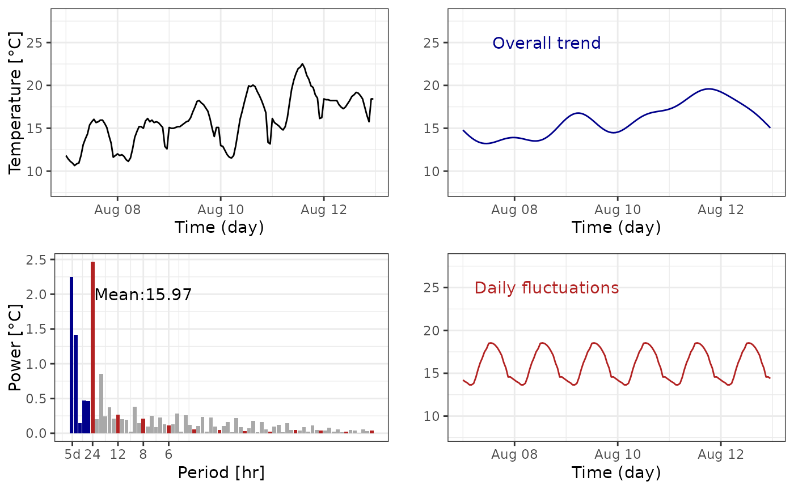

# maths

``` r

library(dplyr)
library(lubridate)
library(ggplot2)
library(cowplot)
library(microclimr)
```

``` r

cols <- c("firebrick", "darkgrey", "darkblue")
data <- hobo |>
  filter(
    month(datetime) == 8,
    day(datetime) %in% 7:12
  ) |>
  arrange(datetime)
fc <- fft_tab(data$t_hobo, 24 * 6) |>
  mutate(coeff_sup = ifelse(frequency > 1 / (24 + 1), 0,
    complex(real = amplitude, imaginary = phase)
  )) |>
  mutate(type = ifelse(frequency > 1 / (24 + 1), "other", "Overall trend")) |>
  mutate(coeff_day = ifelse(frequency %in% c((1:12) / 24),
    complex(real = amplitude, imaginary = phase), 0
  )) |>
  mutate(type = ifelse(frequency %in% c((1:12) / 24),
    "Daily fluctuations", type
  ))
data$t_sup <- fft_reconstruct(fc$coeff_sup, fc$frequency[-1], 1:144)
data$t_day <- fft_reconstruct(
  fc$coeff_day,
  fc$frequency[-1], 1:144
) + fc$power[1]
g_data <- ggplot(data, aes(datetime, t_hobo)) +
  geom_line() +
  theme_bw() +
  xlab("Time (day)") +
  ylab("Temperature [°C]") +
  ylim(8, 28)
g_fc <- fc |>
  filter(period != 0) |>
  ggplot(aes(frequency, power, fill = type)) +
  geom_col() +
  theme_bw() +
  scale_x_continuous(
    breaks = c(1 / (24 * 5), 1 / 24, 1 / 12, 1 / 8, 1 / 6),
    labels = c("5d", "24", "12", "8", "6")
  ) +
  scale_fill_manual(guide = "none", values = cols) +
  xlab("Period [hr]") +
  ylab("Power [°C]") +
  annotate("text",
    x = 3 / 24, y = 2,
    label = paste0("Mean:", round(fc$power[1], 2))
  )
g_sup <- ggplot(data, aes(datetime, t_sup)) +
  geom_line(col = cols[3]) +
  theme_bw() +
  xlab("Time (day)") +
  ylab("") +
  ylim(8, 28) +
  annotate("text",
    x = data$datetime[40], y = 25,
    label = "Overall trend", col = cols[3]
  )
g_day <- ggplot(data, aes(datetime, t_day)) +
  geom_line(col = cols[1]) +
  theme_bw() +
  xlab("Time (day)") +
  ylab("") +
  ylim(8, 28) +
  annotate("text",
    x = data$datetime[40], y = 25,
    label = "Daily fluctuations", col = cols[1]
  )
plot_grid(g_data, g_sup, g_fc, g_day)
```



> The cold should be simplified thanks to internal function from
> microclimr in a short future.

Analysis of time series and particularly periodic signal might be
achieved with the help of the so-called Fourier Analysis and
especifically for sampled signal with the Discrete Fourier Transform.
These tools designed after the work of J. Fourier has been very
fruitfull in a wide range of application to analyzed signal in the
frequency domain.

Fourier Analysis is in fact a set of theoritical and computationnal
tools, for which the most elementary is the so-called Fourier Series
Decomposition we describe in the following. A simple periodic function
like \$ A(2t/T+)\$ is a periodic function with period \\T\\; frequency
\\f = 1/T\\ sometimes multiplied by \\2\pi\\ so that \\\omega =2\pi f =
2\pi/T\\ is called the pulsation; and its amplitude is \\A\\ because it
ranges from its minimum \\-A\\ to its maximum \\A\\. Also the number
\\\varphi\\ is known has the phase and only depends on the reference
time \\0\\. The latter corresponds to a simple shift in time by
\\t\_{0}=\varphi/(2\pi f)\\ so that \\\cos(2\pi t/T+\varphi)) =
\cos(2\pi (t+t\_{0})/T)\\. The function has a mean \\0\\, thus a
generic, \\T\\ periodic signal would be of the form \\ A\_{0} + A\_{1}
\cos(2\pi t/T+\varphi\_{1}) \\ where \\A\_{0}\\ is the mean, \\A\_{1}\\
the amplitude and \\\varphi\_{1}\\ the phase. However a general
\\T\\-periodic function \\S(t)\\ is not has simple like this example,
but a theorem due to Fourier, suggest under very few hypothesis (almost
always true in application) any \\T\\- periodic function might be
decomposed has a sum of its harmonic, says multiple of the fundamental
frequency \\f = 1/T\\, namely \\ S(t) = A\_{0} + A\_{1} \cos(2\pi f
t+\varphi\_{1}) + A\_{2} \cos(4\pi f t+\varphi\_{2}) + A\_{3} \cos(6 \pi
f t+\varphi\_{3}) + \ldots\\ Moreover, the numbers
\\A\_{1},A\_{2},\ldots\\ decrease to \\0\\ significantly fast so that
most of the signal information is contained in the first harmonics, that
is the first coefficients \\A\_{0},A\_{1},A\_{2},\ldots\\ and its
corresponding phase \\\varphi\_{1},\varphi\_{2},\ldots\\  
Such a decomposition is called frequency or Fourier decomposition, this
is the knowledge of two numbers \\(A_k,\varphi_k)\\ for each multiple of
the fundamental frequency, says \\f\_{k}=kf\\

It is worth noticing we have a one to one correspondence between a
periodic signal and its Fourier decomposition, namely all the signal
might be re-construct by virtue of the knowledge of \\A\_{0}, A\_{1},
A\_{2}, \cdots\\ and the respective phase. The squared amplitudes
\\A\_{0}^{2}, A\_{1}^{2}, A\_{2}^{2}, \cdots\\ is called and a famous
relation, the Parseval’s Theorem relates the variance of the signal to
the power spectrum by \\\frac 1 T \int\_{0}^{T} \|S(t) -A\_{0}\|^{2} =
\frac 1 2 \sum\_{k=1}^{\infty} A\_{k}^{2} \\ where \\A\_{0}=\frac 1 T
\int\_{0}^{T}S(t)dt\\ is the mean. One of the strenght of the method is
each coefficient \\A\_{k}\\, is in fact an integration of the signal,
see REF, this means that the coefficients represents and averaged
quantities of the signal and not only a local (temporal) measure of the
signal. This turns the method very robust to noisy signal due measurment
error or local event of the captor.

Hypothetically, any signal is a periodic signal with infinite period
thus having infinitely many frequency and phase, this goes to to a tool
called the Fourier Transform, out of the scope of this presentation. But
in application signal is analyzis on a finite time window \\\[0,T\]\\
where \\T\\ may range from days to years or decades depending on what
matters (climatic, seasonnal, dayly effect). But this pieace of
information can be seen as a portion of a periodic signal with period
\\T\\ and the analysis follows as presented above.

As an example, microclimate data can be analyzed on few days window to
avoid long trend effect (seasonal, climate change) and analyze the local
response to a given condition of temperatures. Assume, climate data
sampled at interval of 1 hour during 5 days, says \\T=24\cdot 5\\ and
\\N = 24\cdot 5\\ data given by \\S\_{1},\ldots,S\_{N}\\: The best we
can do is to approximate this points with the following Fourier series:

\\ S(t) = A\_{0} + \sum\_{k=1}^{N/2} A\_{k}\cos ( 2k\pi f t +
\varphi\_{k}) \\ with \\A\_{k}\geq 0\\ for \\k=1,\ldots,N/2\\, and \\f =
1/T\\. The limitation to a multiple of the frequency \\N/2\\ is due to
the fact that variation faster than the sampled rate cannot be captured.
Note, the coefficient \\A\_{k}\\ and \\\varphi\_{k}\\ are computed with
a very efficient method called the Fast Fourier Transform (FFT).

We notice the formula contains the multliple of the frequency \\f = 1/5
\\d^{-1} = 1/120 \\ h^{-1}\\. The first mutliple \\f\_{1}\\, \\f\_{2}\\
up to \\f\_{4}\\ contains variation on the dayly to weekly range
(meteorological variation), but this subset contains the frequency
\\f\_{5} = 1/24 h^{-1}\\ and its own multiple \\f\_{10}, f\_{15}\\, etc
which contains the daily information and its harmonics. But temperatures
signal exhibits clearly a dayly periodicity over a general trend, this
is why comparing the powers between reference weather to microclimate
air and soil decomposition is efficiently down by the comparison of the
power spectrum for this peculiar frequencies.

Indeed, the principle of comparison of two sampled signal
\\S\_{1},S\_{2}, \ldots\\ and \\R\_{1},R\_{2}, \ldots\\ at times
\\t\_{1}, t\_{2},\ldots\\ (says macro and microclimate) may be done as a
first approximation by the comparison of \\S_n\\ versus \\R_n\\, the
method we proposed is to compare the Fourier coefficients \\A\_{k}(S)\\
vs \\B\_{k}(R)\\, respectively for the signal \\S\\ and \\R\\. The
knowlege of the transformation of \\A\_{k}(S)\\ to \\A\_{k}(R)\\ by
statistical approach allows to reconstruct a coherent signal \\R\\ from
\\S\\ or the reverse. Of course we omit in this presentation the
treatment of the phase which is in the same fashion but with the
carefull attention that phase is not uniquely define (only modulo \\2\pi
k\\). Maybe the most important fact in this representation is most of
the transformation is contained in the part of the spectrum that capure
most of the total power (see the Parseval Theorem). In our case it is
generally dayly frequencies associate to the mean.

It is worth noticing that the method can be improved in particular with
the use of windowing methods which is out of the scope of this
presentation and more advanced methods from signal analyzis. But we
believe this first treatment incorporates the key point of view to
provide robust statistical analyzis of the transformation form macro to
microclimate.

## Particular notes on the Fourier coeffcients.

For \\N\\ samples with \\N\\ even, the FFT methods (used in the package)
render complex numbers \\c_k= a_k-ib_k\\ for \\k=0,\ldots N/2\\. Always,
\\b_0=0\\ and \\A_0 = c_0 = a_0\\, the amplitudes for \\k\geq 1\\ are \\
A_k = \sqrt{a_k^2 + b_k^2} \\ so the powers are \\ A_k^2 = a_k^2 + b_k^2
. \\

To compute the phase for \\k\geq 1\\ \\ \varphi_k = Arg(a_k-ib_k)\\
where \\Arg\\ is the function argument of a complex number.

The fourier series might be written equivalently

\\ S(t) = a_0 + \sum\_{k=1}^{N/2} a_k \cos(2\pi k f t) + b_k \sin(2\pi k
f t) \\
